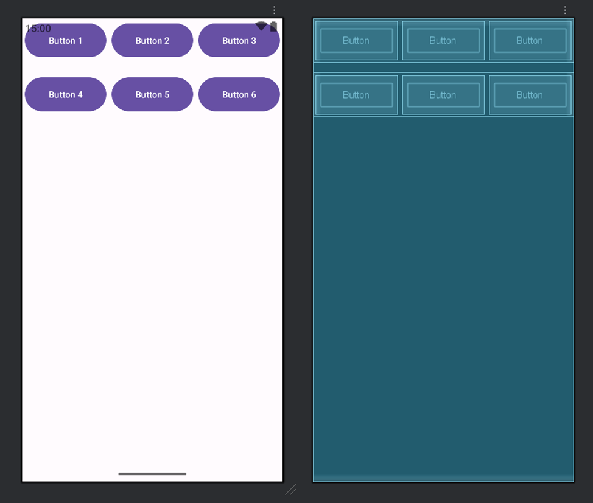
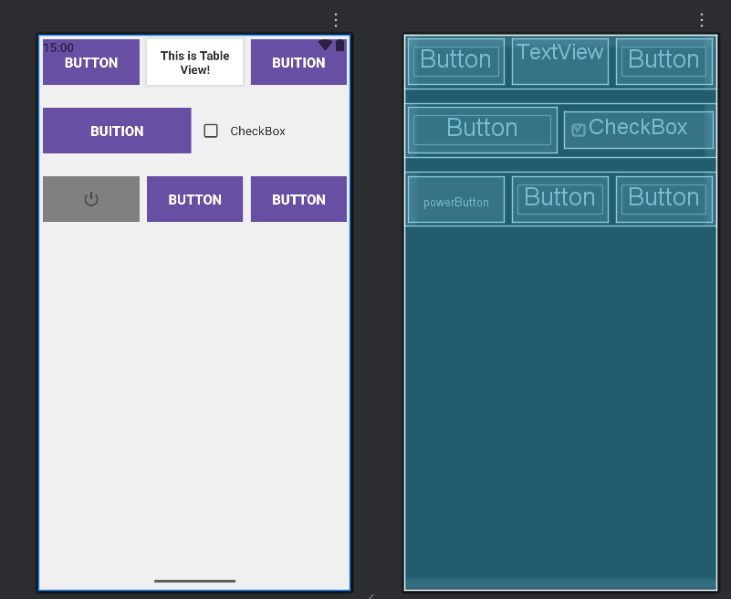
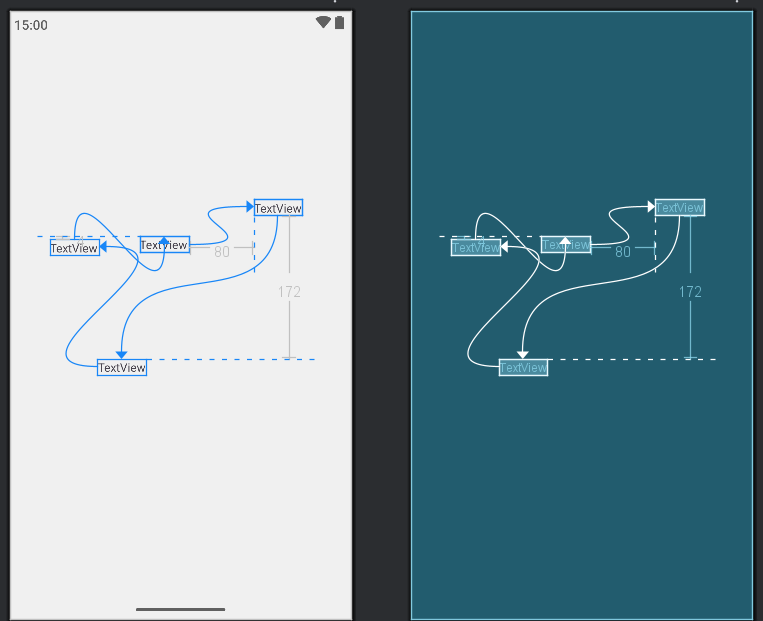
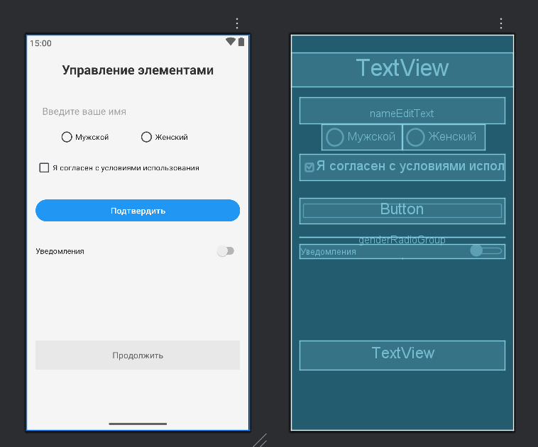

# Практика 1
Arikova Kristina

## Разработка мобильных компонент анализа безопасности

информационно-аналитических систем

*Задание: изучить атрибуты макетов «ViewGroup» и для каждого типа
создать свой Layout.*

------------------------------------------------------------------------

``` xml
<?xml version="1.0" encoding="utf-8"?>
<LinearLayout xmlns:android="http://schemas.android.com/apk/res/android"
    android:layout_width="match_parent"
    android:layout_height="match_parent"
    android:orientation="vertical">

    <LinearLayout
        android:layout_width="match_parent"
        android:layout_height="wrap_content"
        android:orientation="horizontal">

        <Button
            android:id="@+id/button1"
            android:layout_width="0dp"
            android:layout_height="61dp"
            android:layout_margin="4dp"
            android:layout_weight="1"
            android:text="Button 1" />

        <Button
            android:id="@+id/button2"
            android:layout_width="0dp"
            android:layout_height="61dp"
            android:layout_margin="4dp"
            android:layout_weight="1"
            android:text="Button 2" />

        <Button
            android:id="@+id/button3"
            android:layout_width="0dp"
            android:layout_height="61dp"
            android:layout_margin="4dp"
            android:layout_weight="1"
            android:text="Button 3" />

    </LinearLayout>

    <LinearLayout
        android:layout_width="match_parent"
        android:layout_height="wrap_content"
        android:layout_marginTop="16dp"
        android:orientation="horizontal">

        <Button
            android:id="@+id/button4"
            android:layout_width="0dp"
            android:layout_height="61dp"
            android:layout_margin="4dp"
            android:layout_weight="1"
            android:text="Button 4" />

        <Button
            android:id="@+id/button5"
            android:layout_width="0dp"
            android:layout_height="61dp"
            android:layout_margin="4dp"
            android:layout_weight="1"
            android:text="Button 5" />

        <Button
            android:id="@+id/button6"
            android:layout_width="0dp"
            android:layout_height="61dp"
            android:layout_margin="4dp"
            android:layout_weight="1"
            android:text="Button 6" />

    </LinearLayout>

</LinearLayout>
```

------------------------------------------------------------------------

Результат:



<!-- Все кнопки имеют одинаковую конструкцию -->

    \<Button

        android:layout_width=“0dp”      
<!-- ширина определяется весом -->

        android:layout_height=“61dp”     <!-- фиксированная высота -->

        android:layout_weight=“1”        <!-- равная доля ширины -->

        android:layout_margin=“4dp”      <!-- отступы вокруг -->

        android:text=“Button” /\>

*Задание: создайте экран приведённый на рис. 4.3 из методички.*

------------------------------------------------------------------------

``` xml
<?xml version="1.0" encoding="utf-8"?>
<LinearLayout xmlns:android="http://schemas.android.com/apk/res/android"
    android:layout_width="match_parent"
    android:layout_height="match_parent"
    android:background="#f0f0f0"
    android:orientation="vertical"
    android:padding="0dp">

    <LinearLayout
        android:layout_width="match_parent"
        android:layout_height="wrap_content"
        android:background="#f0f0f0"
        android:orientation="horizontal"
        android:gravity="center_vertical"
        android:weightSum="3"
        android:layout_marginBottom="20dp">

        <Button
            android:id="@+id/button1"
            android:layout_width="0dp"
            android:layout_height="60dp"
            android:layout_weight="1"
            android:layout_margin="5dp"
            android:background="#2196F3"
            android:text="BUTTON"
            android:textColor="#FFFFFF"
            android:textSize="18sp"
            android:textStyle="bold" />

        <TextView
            android:id="@+id/tableTextView"
            android:layout_width="0dp"
            android:layout_height="wrap_content"
            android:layout_weight="1"
            android:layout_margin="5dp"
            android:background="#FFFFFF"
            android:elevation="4dp"
            android:gravity="center"
            android:padding="10dp"
            android:text="This is Table View!"
            android:textColor="#333333"
            android:textSize="16sp"
            android:textStyle="bold" />

        <Button
            android:id="@+id/button2"
            android:layout_width="0dp"
            android:layout_height="60dp"
            android:layout_weight="1"
            android:layout_margin="5dp"
            android:background="#FF9800"
            android:text="BUITION"
            android:textColor="#FFFFFF"
            android:textSize="18sp"
            android:textStyle="bold" />
    </LinearLayout>

    <LinearLayout
        android:layout_width="match_parent"
        android:layout_height="wrap_content"
        android:background="#f0f0f0"
        android:orientation="horizontal"
        android:gravity="center_vertical"
        android:weightSum="2"
        android:layout_marginBottom="20dp">

        <Button
            android:id="@+id/button3"
            android:layout_width="0dp"
            android:layout_height="60dp"
            android:layout_weight="1"
            android:layout_margin="5dp"
            android:background="#4CAF50"
            android:text="BUITION"
            android:textColor="#FFFFFF"
            android:textSize="18sp"
            android:textStyle="bold" />

        <CheckBox
            android:id="@+id/checkBox"
            android:layout_width="0dp"
            android:layout_height="wrap_content"
            android:layout_weight="1"
            android:layout_margin="5dp"
            android:gravity="center_vertical"
            android:padding="10dp"
            android:text="CheckBox"
            android:textColor="#333333"
            android:textSize="16sp" />
    </LinearLayout>

  
    <LinearLayout
        android:layout_width="match_parent"
        android:layout_height="wrap_content"
        android:background="#f0f0f0"
        android:orientation="horizontal"
        android:gravity="center_vertical"
        android:weightSum="3">

        <ImageButton
            android:id="@+id/powerButton"
            android:layout_width="0dp"
            android:layout_height="60dp"
            android:layout_weight="1"
            android:layout_margin="5dp"
            android:background="#808080"
            android:src="@android:drawable/ic_lock_power_off"
            android:contentDescription="Power off"
            android:scaleType="centerInside"
            android:padding="15dp" />

        <Button
            android:id="@+id/button5"
            android:layout_width="0dp"
            android:layout_height="60dp"
            android:layout_weight="1"
            android:layout_margin="5dp"
            android:background="#9C27B0"
            android:text="BUTTON"
            android:textColor="#FFFFFF"
            android:textSize="18sp"
            android:textStyle="bold" />

        <Button
            android:id="@+id/button6"
            android:layout_width="0dp"
            android:layout_height="60dp"
            android:layout_weight="1"
            android:layout_margin="5dp"
            android:background="#9C27B0"
            android:text="BUTTON"
            android:textColor="#FFFFFF"
            android:textSize="18sp"
            android:textStyle="bold" />
    </LinearLayout>
</LinearLayout>
```

------------------------------------------------------------------------

*Задание: создать экран по методичке.*

``` xml
<?xml version="1.0" encoding="utf-8"?>
<LinearLayout xmlns:android="http://schemas.android.com/apk/res/android"
    android:layout_width="match_parent"
    android:layout_height="match_parent"
    android:background="#f0f0f0"
    android:orientation="vertical"
    android:padding="0dp">

    <LinearLayout
        android:layout_width="match_parent"
        android:layout_height="wrap_content"
        android:background="#f0f0f0"
        android:orientation="horizontal"
        android:gravity="center_vertical"
        android:weightSum="3"
        android:layout_marginBottom="20dp">

        <Button
            android:id="@+id/button1"
            android:layout_width="0dp"
            android:layout_height="60dp"
            android:layout_weight="1"
            android:layout_margin="5dp"
            android:background="#2196F3"
            android:text="BUTTON"
            android:textColor="#FFFFFF"
            android:textSize="18sp"
            android:textStyle="bold" />

        <TextView
            android:id="@+id/tableTextView"
            android:layout_width="0dp"
            android:layout_height="wrap_content"
            android:layout_weight="1"
            android:layout_margin="5dp"
            android:background="#FFFFFF"
            android:elevation="4dp"
            android:gravity="center"
            android:padding="10dp"
            android:text="This is Table View!"
            android:textColor="#333333"
            android:textSize="16sp"
            android:textStyle="bold" />

        <Button
            android:id="@+id/button2"
            android:layout_width="0dp"
            android:layout_height="60dp"
            android:layout_weight="1"
            android:layout_margin="5dp"
            android:background="#FF9800"
            android:text="BUITION"
            android:textColor="#FFFFFF"
            android:textSize="18sp"
            android:textStyle="bold" />
    </LinearLayout>

    <LinearLayout
        android:layout_width="match_parent"
        android:layout_height="wrap_content"
        android:background="#f0f0f0"
        android:orientation="horizontal"
        android:gravity="center_vertical"
        android:weightSum="2"
        android:layout_marginBottom="20dp">

        <Button
            android:id="@+id/button3"
            android:layout_width="0dp"
            android:layout_height="60dp"
            android:layout_weight="1"
            android:layout_margin="5dp"
            android:background="#4CAF50"
            android:text="BUITION"
            android:textColor="#FFFFFF"
            android:textSize="18sp"
            android:textStyle="bold" />

        <CheckBox
            android:id="@+id/checkBox"
            android:layout_width="0dp"
            android:layout_height="wrap_content"
            android:layout_weight="1"
            android:layout_margin="5dp"
            android:gravity="center_vertical"
            android:padding="10dp"
            android:text="CheckBox"
            android:textColor="#333333"
            android:textSize="16sp" />
    </LinearLayout>

    <LinearLayout
        android:layout_width="match_parent"
        android:layout_height="wrap_content"
        android:background="#f0f0f0"
        android:orientation="horizontal"
        android:gravity="center_vertical"
        android:weightSum="3">

        <ImageButton
            android:id="@+id/powerButton"
            android:layout_width="0dp"
            android:layout_height="60dp"
            android:layout_weight="1"
            android:layout_margin="5dp"
            android:background="#808080"
            android:src="@android:drawable/ic_lock_power_off"
            android:contentDescription="Power off"
            android:scaleType="centerInside"
            android:padding="15dp" />

        <Button
            android:id="@+id/button5"
            android:layout_width="0dp"
            android:layout_height="60dp"
            android:layout_weight="1"
            android:layout_margin="5dp"
            android:background="#9C27B0"
            android:text="BUTTON"
            android:textColor="#FFFFFF"
            android:textSize="18sp"
            android:textStyle="bold" />

        <Button
            android:id="@+id/button6"
            android:layout_width="0dp"
            android:layout_height="60dp"
            android:layout_weight="1"
            android:layout_margin="5dp"
            android:background="#9C27B0"
            android:text="BUTTON"
            android:textColor="#FFFFFF"
            android:textSize="18sp"
            android:textStyle="bold" />
    </LinearLayout>
</LinearLayout>
```

Результат:



*Задание: добавить на экран несколько элементов и привязать их между
собой.*

------------------------------------------------------------------------

``` xml
<?xml version="1.0" encoding="utf-8"?>
<androidx.constraintlayout.widget.ConstraintLayout xmlns:android="http://schemas.android.com/apk/res/android"
    xmlns:app="http://schemas.android.com/apk/res-auto"
    xmlns:tools="http://schemas.android.com/tools"
    android:layout_width="match_parent"
    android:layout_height="match_parent"
    android:background="#f0f0f0"
    android:padding="20dp">

    <TextView
        android:id="@+id/textView5"
        android:layout_width="wrap_content"
        android:layout_height="wrap_content"
        android:layout_marginTop="4dp"
        android:text="TextView"
        app:layout_constraintTop_toTopOf="@+id/textView6"
        tools:layout_editor_absoluteX="28dp" />

    <TextView
        android:id="@+id/textView6"
        android:layout_width="wrap_content"
        android:layout_height="wrap_content"
        android:layout_marginEnd="80dp"
        android:text="TextView"
        app:layout_constraintEnd_toStartOf="@+id/textView7"
        tools:layout_editor_absoluteY="250dp" />

    <TextView
        android:id="@+id/textView7"
        android:layout_width="wrap_content"
        android:layout_height="wrap_content"
        android:layout_marginBottom="172dp"
        android:text="TextView"
        app:layout_constraintBottom_toTopOf="@+id/textView8"
        tools:layout_editor_absoluteX="274dp" />

    <TextView
        android:id="@+id/textView8"
        android:layout_width="wrap_content"
        android:layout_height="wrap_content"
        android:text="TextView"
        app:layout_constraintStart_toEndOf="@+id/textView5"
        tools:layout_editor_absoluteY="398dp" />
</androidx.constraintlayout.widget.ConstraintLayout>
```

------------------------------------------------------------------------

Результат:



*Задание: создать новый модуль «control_lesson1». Требуется создать
собственный экран с использованием изученных элементов.*

------------------------------------------------------------------------

``` xml
<?xml version="1.0" encoding="utf-8"?>
<androidx.constraintlayout.widget.ConstraintLayout xmlns:android="http://schemas.android.com/apk/res/android"
    xmlns:app="http://schemas.android.com/apk/res-auto"
    xmlns:tools="http://schemas.android.com/tools"
    android:layout_width="match_parent"
    android:layout_height="match_parent"
    android:background="#f5f5f5"
    tools:context=".MainActivity">
    
    <TextView
        android:id="@+id/titleTextView"
        android:layout_width="0dp"
        android:layout_height="wrap_content"
        android:layout_marginTop="32dp"
        android:gravity="center"
        android:padding="16dp"
        android:text="Управление элементами"
        android:textColor="#333333"
        android:textSize="24sp"
        android:textStyle="bold"
        app:layout_constraintEnd_toEndOf="parent"
        app:layout_constraintHorizontal_bias="0.0"
        app:layout_constraintStart_toStartOf="parent"
        app:layout_constraintTop_toTopOf="parent" />

    <EditText
        android:id="@+id/nameEditText"
        android:layout_width="0dp"
        android:layout_height="wrap_content"
        android:layout_marginTop="20dp"
        android:layout_marginStart="16dp"
        android:layout_marginEnd="16dp"
        android:hint="Введите ваше имя"
        android:inputType="textPersonName"
        android:background="@drawable/edittext_background"
        android:padding="12dp"
        app:layout_constraintTop_toBottomOf="@+id/titleTextView"
        app:layout_constraintStart_toStartOf="parent"
        app:layout_constraintEnd_toEndOf="parent" />

    <Button
        android:id="@+id/submitButton"
        android:layout_width="0dp"
        android:layout_height="wrap_content"
        android:layout_marginStart="16dp"
        android:layout_marginTop="136dp"
        android:layout_marginEnd="16dp"
        android:backgroundTint="#2196F3"
        android:text="Подтвердить"
        android:textColor="#FFFFFF"
        android:textSize="16sp"
        app:layout_constraintEnd_toEndOf="parent"
        app:layout_constraintHorizontal_bias="1.0"
        app:layout_constraintStart_toStartOf="parent"
        app:layout_constraintTop_toBottomOf="@+id/nameEditText" />

    <CheckBox
        android:id="@+id/termsCheckBox"
        android:layout_width="0dp"
        android:layout_height="wrap_content"
        android:layout_marginStart="16dp"
        android:layout_marginEnd="16dp"
        android:text="Я согласен с условиями использования"
        android:textSize="14sp"
        app:layout_constraintEnd_toEndOf="parent"
        app:layout_constraintHorizontal_bias="0.0"
        app:layout_constraintStart_toStartOf="parent"
        tools:layout_editor_absoluteY="222dp" />


    <RadioGroup
        android:id="@+id/genderRadioGroup"
        android:layout_width="0dp"
        android:layout_height="wrap_content"
        android:layout_marginStart="16dp"
        android:layout_marginEnd="16dp"
        android:orientation="horizontal"
        app:layout_constraintEnd_toEndOf="parent"
        app:layout_constraintHorizontal_bias="0.0"
        app:layout_constraintStart_toStartOf="parent"
        tools:layout_editor_absoluteY="374dp">

    </RadioGroup>

    <Switch
        android:id="@+id/notificationSwitch"
        android:layout_width="0dp"
        android:layout_height="wrap_content"
        android:layout_marginStart="16dp"
        android:layout_marginTop="12dp"
        android:layout_marginEnd="16dp"
        android:text="Уведомления"
        android:textSize="14sp"
        app:layout_constraintEnd_toEndOf="parent"
        app:layout_constraintHorizontal_bias="1.0"
        app:layout_constraintStart_toStartOf="parent"
        app:layout_constraintTop_toBottomOf="@+id/genderRadioGroup" />

    <ProgressBar
        android:id="@+id/loadingProgressBar"
        android:layout_width="wrap_content"
        android:layout_height="wrap_content"
        android:layout_marginTop="16dp"
        android:visibility="gone"
        app:layout_constraintTop_toBottomOf="@+id/notificationSwitch"
        app:layout_constraintStart_toStartOf="parent"
        app:layout_constraintEnd_toEndOf="parent" />


    <TextView
        android:id="@+id/resultTextView"
        android:layout_width="0dp"
        android:layout_height="wrap_content"
        android:layout_marginStart="16dp"
        android:layout_marginTop="16dp"
        android:layout_marginEnd="16dp"
        android:layout_marginBottom="16dp"
        android:background="#E8E8E8"
        android:gravity="center"
        android:padding="16dp"
        android:text="Продолжить"
        android:textColor="#666666"
        android:textSize="16sp"
        app:layout_constraintBottom_toBottomOf="parent"
        app:layout_constraintEnd_toEndOf="parent"
        app:layout_constraintHorizontal_bias="0.0"
        app:layout_constraintStart_toStartOf="parent"
        app:layout_constraintTop_toBottomOf="@+id/loadingProgressBar"
        app:layout_constraintVertical_bias="0.586" />

    <RadioButton
        android:id="@+id/maleRadioButton"
        android:layout_width="148dp"
        android:layout_height="48dp"
        android:layout_weight="1"
        android:text="Мужской"
        android:textSize="14sp"
        tools:layout_editor_absoluteX="58dp"
        tools:layout_editor_absoluteY="165dp" />

    <RadioButton
        android:id="@+id/femaleRadioButton"
        android:layout_width="153dp"
        android:layout_height="48dp"
        android:layout_weight="1"
        android:text="Женский"
        android:textSize="14sp"
        tools:layout_editor_absoluteX="206dp"
        tools:layout_editor_absoluteY="165dp" />

</androidx.constraintlayout.widget.ConstraintLayout>
```

Результат:


