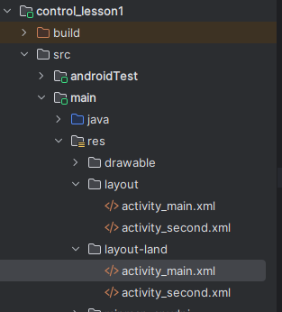

# Практика 1
Arikova Kristina

## Разработка мобильных компонент анализа безопасности информационно-аналитических систем

*Задание: изучить атрибуты макетов «ViewGroup» и для каждого типа
создать свой Layout.*

------------------------------------------------------------------------

``` xml
<?xml version="1.0" encoding="utf-8"?>
<LinearLayout xmlns:android="http://schemas.android.com/apk/res/android"
    android:layout_width="match_parent"
    android:layout_height="match_parent"
    android:orientation="vertical">

    <LinearLayout
        android:layout_width="match_parent"
        android:layout_height="wrap_content"
        android:orientation="horizontal">

        <Button
            android:id="@+id/button1"
            android:layout_width="0dp"
            android:layout_height="61dp"
            android:layout_margin="4dp"
            android:layout_weight="1"
            android:text="Button 1" />

        <Button
            android:id="@+id/button2"
            android:layout_width="0dp"
            android:layout_height="61dp"
            android:layout_margin="4dp"
            android:layout_weight="1"
            android:text="Button 2" />

        <Button
            android:id="@+id/button3"
            android:layout_width="0dp"
            android:layout_height="61dp"
            android:layout_margin="4dp"
            android:layout_weight="1"
            android:text="Button 3" />

    </LinearLayout>

    <LinearLayout
        android:layout_width="match_parent"
        android:layout_height="wrap_content"
        android:layout_marginTop="16dp"
        android:orientation="horizontal">

        <Button
            android:id="@+id/button4"
            android:layout_width="0dp"
            android:layout_height="61dp"
            android:layout_margin="4dp"
            android:layout_weight="1"
            android:text="Button 4" />

        <Button
            android:id="@+id/button5"
            android:layout_width="0dp"
            android:layout_height="61dp"
            android:layout_margin="4dp"
            android:layout_weight="1"
            android:text="Button 5" />

        <Button
            android:id="@+id/button6"
            android:layout_width="0dp"
            android:layout_height="61dp"
            android:layout_margin="4dp"
            android:layout_weight="1"
            android:text="Button 6" />

    </LinearLayout>

</LinearLayout>
```

------------------------------------------------------------------------

Результат:


``` xml
<!-- Все кнопки имеют одинаковую конструкцию -->

    <Button

        android:layout_width="0dp"       <!-- ширина определяется весом -->

        android:layout_height="61dp"     <!-- фиксированная высота -->

        android:layout_weight="1"        <!-- равная доля ширины -->

        android:layout_margin="4dp"      <!-- отступы вокруг -->

        android:text="Button" />
```

------------------------------------------------------------------------

*Задание: создать экран по методичке.*

``` xml
<?xml version="1.0" encoding="utf-8"?>
<LinearLayout xmlns:android="http://schemas.android.com/apk/res/android"
    android:layout_width="match_parent"
    android:layout_height="match_parent"
    android:background="#f0f0f0"
    android:orientation="vertical"
    android:padding="0dp">

    <LinearLayout
        android:layout_width="match_parent"
        android:layout_height="wrap_content"
        android:background="#f0f0f0"
        android:orientation="horizontal"
        android:gravity="center_vertical"
        android:weightSum="3"
        android:layout_marginBottom="20dp">

        <Button
            android:id="@+id/button1"
            android:layout_width="0dp"
            android:layout_height="60dp"
            android:layout_weight="1"
            android:layout_margin="5dp"
            android:background="#2196F3"
            android:text="BUTTON"
            android:textColor="#FFFFFF"
            android:textSize="18sp"
            android:textStyle="bold" />

        <TextView
            android:id="@+id/tableTextView"
            android:layout_width="0dp"
            android:layout_height="wrap_content"
            android:layout_weight="1"
            android:layout_margin="5dp"
            android:background="#FFFFFF"
            android:elevation="4dp"
            android:gravity="center"
            android:padding="10dp"
            android:text="This is Table View!"
            android:textColor="#333333"
            android:textSize="16sp"
            android:textStyle="bold" />

        <Button
            android:id="@+id/button2"
            android:layout_width="0dp"
            android:layout_height="60dp"
            android:layout_weight="1"
            android:layout_margin="5dp"
            android:background="#FF9800"
            android:text="BUITION"
            android:textColor="#FFFFFF"
            android:textSize="18sp"
            android:textStyle="bold" />
    </LinearLayout>

    <LinearLayout
        android:layout_width="match_parent"
        android:layout_height="wrap_content"
        android:background="#f0f0f0"
        android:orientation="horizontal"
        android:gravity="center_vertical"
        android:weightSum="2"
        android:layout_marginBottom="20dp">

        <Button
            android:id="@+id/button3"
            android:layout_width="0dp"
            android:layout_height="60dp"
            android:layout_weight="1"
            android:layout_margin="5dp"
            android:background="#4CAF50"
            android:text="BUITION"
            android:textColor="#FFFFFF"
            android:textSize="18sp"
            android:textStyle="bold" />

        <CheckBox
            android:id="@+id/checkBox"
            android:layout_width="0dp"
            android:layout_height="wrap_content"
            android:layout_weight="1"
            android:layout_margin="5dp"
            android:gravity="center_vertical"
            android:padding="10dp"
            android:text="CheckBox"
            android:textColor="#333333"
            android:textSize="16sp" />
    </LinearLayout>

    <LinearLayout
        android:layout_width="match_parent"
        android:layout_height="wrap_content"
        android:background="#f0f0f0"
        android:orientation="horizontal"
        android:gravity="center_vertical"
        android:weightSum="3">

        <ImageButton
            android:id="@+id/powerButton"
            android:layout_width="0dp"
            android:layout_height="60dp"
            android:layout_weight="1"
            android:layout_margin="5dp"
            android:background="#808080"
            android:src="@android:drawable/ic_lock_power_off"
            android:contentDescription="Power off"
            android:scaleType="centerInside"
            android:padding="15dp" />

        <Button
            android:id="@+id/button5"
            android:layout_width="0dp"
            android:layout_height="60dp"
            android:layout_weight="1"
            android:layout_margin="5dp"
            android:background="#9C27B0"
            android:text="BUTTON"
            android:textColor="#FFFFFF"
            android:textSize="18sp"
            android:textStyle="bold" />

        <Button
            android:id="@+id/button6"
            android:layout_width="0dp"
            android:layout_height="60dp"
            android:layout_weight="1"
            android:layout_margin="5dp"
            android:background="#9C27B0"
            android:text="BUTTON"
            android:textColor="#FFFFFF"
            android:textSize="18sp"
            android:textStyle="bold" />
    </LinearLayout>
</LinearLayout>
```

Результат:


------------------------------------------------------------------------

*Задание: добавить на экран несколько элементов и привязать их между
собой.*

------------------------------------------------------------------------

``` xml
<?xml version="1.0" encoding="utf-8"?>
<androidx.constraintlayout.widget.ConstraintLayout xmlns:android="http://schemas.android.com/apk/res/android"
    xmlns:app="http://schemas.android.com/apk/res-auto"
    xmlns:tools="http://schemas.android.com/tools"
    android:layout_width="match_parent"
    android:layout_height="match_parent"
    android:background="#f0f0f0"
    android:padding="20dp">

    <TextView
        android:id="@+id/textView5"
        android:layout_width="wrap_content"
        android:layout_height="wrap_content"
        android:layout_marginTop="4dp"
        android:text="TextView"
        app:layout_constraintTop_toTopOf="@+id/textView6"
        tools:layout_editor_absoluteX="28dp" />

    <TextView
        android:id="@+id/textView6"
        android:layout_width="wrap_content"
        android:layout_height="wrap_content"
        android:layout_marginEnd="80dp"
        android:text="TextView"
        app:layout_constraintEnd_toStartOf="@+id/textView7"
        tools:layout_editor_absoluteY="250dp" />

    <TextView
        android:id="@+id/textView7"
        android:layout_width="wrap_content"
        android:layout_height="wrap_content"
        android:layout_marginBottom="172dp"
        android:text="TextView"
        app:layout_constraintBottom_toTopOf="@+id/textView8"
        tools:layout_editor_absoluteX="274dp" />

    <TextView
        android:id="@+id/textView8"
        android:layout_width="wrap_content"
        android:layout_height="wrap_content"
        android:text="TextView"
        app:layout_constraintStart_toEndOf="@+id/textView5"
        tools:layout_editor_absoluteY="398dp" />
</androidx.constraintlayout.widget.ConstraintLayout>
```

------------------------------------------------------------------------

Результат:


------------------------------------------------------------------------

*Задание: создать новый модуль «control_lesson1». Требуется создать
собственный экран с использованием изученных элементов.*

------------------------------------------------------------------------

``` xml
<?xml version="1.0" encoding="utf-8"?>
<androidx.constraintlayout.widget.ConstraintLayout xmlns:android="http://schemas.android.com/apk/res/android"
    xmlns:app="http://schemas.android.com/apk/res-auto"
    xmlns:tools="http://schemas.android.com/tools"
    android:layout_width="match_parent"
    android:layout_height="match_parent"
    android:background="#f5f5f5"
    tools:context=".MainActivity">

    <TextView
        android:id="@+id/titleTextView"
        android:layout_width="0dp"
        android:layout_height="wrap_content"
        android:layout_marginTop="32dp"
        android:layout_marginStart="16dp"
        android:layout_marginEnd="16dp"
        android:gravity="center"
        android:padding="16dp"
        android:text="Управление элементами"
        android:textColor="#333333"
        android:textSize="24sp"
        android:textStyle="bold"
        android:background="#FFFFFF"
        android:elevation="4dp"
        app:layout_constraintEnd_toEndOf="parent"
        app:layout_constraintStart_toStartOf="parent"
        app:layout_constraintTop_toTopOf="parent" />

    <EditText
        android:id="@+id/nameEditText"
        android:layout_width="0dp"
        android:layout_height="wrap_content"
        android:layout_marginTop="24dp"
        android:layout_marginStart="16dp"
        android:layout_marginEnd="16dp"
        android:hint="Введите ваше имя"
        android:inputType="textPersonName"
        android:background="@drawable/edittext_background"
        android:padding="12dp"
        android:textSize="16sp"
        app:layout_constraintTop_toBottomOf="@+id/titleTextView"
        app:layout_constraintStart_toStartOf="parent"
        app:layout_constraintEnd_toEndOf="parent" />

    <CheckBox
        android:id="@+id/termsCheckBox"
        android:layout_width="0dp"
        android:layout_height="wrap_content"
        android:layout_marginTop="16dp"
        android:layout_marginStart="16dp"
        android:layout_marginEnd="16dp"
        android:text="Я согласен с условиями использования"
        android:textSize="14sp"
        app:layout_constraintTop_toBottomOf="@+id/nameEditText"
        app:layout_constraintStart_toStartOf="parent"
        app:layout_constraintEnd_toEndOf="parent" />

    <RadioGroup
        android:id="@+id/genderRadioGroup"
        android:layout_width="0dp"
        android:layout_height="wrap_content"
        android:layout_marginTop="24dp"
        android:layout_marginStart="16dp"
        android:layout_marginEnd="16dp"
        android:orientation="horizontal"
        android:background="#FFFFFF"
        android:padding="12dp"
        app:layout_constraintTop_toBottomOf="@+id/termsCheckBox"
        app:layout_constraintStart_toStartOf="parent"
        app:layout_constraintEnd_toEndOf="parent">

        <RadioButton
            android:id="@+id/maleRadioButton"
            android:layout_width="0dp"
            android:layout_height="wrap_content"
            android:layout_weight="1"
            android:text="Мужской"
            android:textSize="14sp"
            android:padding="8dp" />

        <RadioButton
            android:id="@+id/femaleRadioButton"
            android:layout_width="0dp"
            android:layout_height="wrap_content"
            android:layout_weight="1"
            android:text="Женский"
            android:textSize="14sp"
            android:padding="8dp" />

    </RadioGroup>

    <Switch
        android:id="@+id/notificationSwitch"
        android:layout_width="0dp"
        android:layout_height="wrap_content"
        android:layout_marginTop="24dp"
        android:layout_marginStart="16dp"
        android:layout_marginEnd="16dp"
        android:text="Включить уведомления"
        android:textSize="14sp"
        android:checked="true"
        app:layout_constraintTop_toBottomOf="@+id/genderRadioGroup"
        app:layout_constraintStart_toStartOf="parent"
        app:layout_constraintEnd_toEndOf="parent" />

    <Button
        android:id="@+id/submitButton"
        android:layout_width="0dp"
        android:layout_height="wrap_content"
        android:layout_marginTop="32dp"
        android:layout_marginStart="16dp"
        android:layout_marginEnd="16dp"
        android:backgroundTint="#2196F3"
        android:text="Подтвердить данные"
        android:textColor="#FFFFFF"
        android:textSize="16sp"
        android:textStyle="bold"
        android:enabled="false"
        app:layout_constraintTop_toBottomOf="@+id/notificationSwitch"
        app:layout_constraintStart_toStartOf="parent"
        app:layout_constraintEnd_toEndOf="parent" />

    <ProgressBar
        android:id="@+id/loadingProgressBar"
        android:layout_width="wrap_content"
        android:layout_height="wrap_content"
        android:layout_marginTop="16dp"
        android:visibility="gone"
        app:layout_constraintTop_toBottomOf="@+id/submitButton"
        app:layout_constraintStart_toStartOf="parent"
        app:layout_constraintEnd_toEndOf="parent" />

    <TextView
        android:id="@+id/resultTextView"
        android:layout_width="0dp"
        android:layout_height="0dp"
        android:layout_marginStart="16dp"
        android:layout_marginTop="24dp"
        android:layout_marginEnd="16dp"
        android:layout_marginBottom="16dp"
        android:background="#E8E8E8"
        android:gravity="center"
        android:padding="20dp"
        android:text="Здесь будут отображены результаты после подтверждения"
        android:textColor="#666666"
        android:textSize="14sp"
        android:lineSpacingExtra="4dp"
        app:layout_constraintTop_toBottomOf="@+id/loadingProgressBar"
        app:layout_constraintBottom_toBottomOf="parent"
        app:layout_constraintStart_toStartOf="parent"
        app:layout_constraintEnd_toEndOf="parent" />

</androidx.constraintlayout.widget.ConstraintLayout>
```

Результат:


Каждый элемент привязывается к другим элементам или к границам родителя
с помощью constraint-атрибутов.

Задание: создать layout-файл «activity_second.xml».В созданном
layout-файле необходимо добавить на экран элемент «PlainText» и изменить
его текст на: «New life for mirea activity!» и 6 кнопок button.

Листинг программы \control_lesson1\_second.xml:

``` xml
<?xml version="1.0" encoding="utf-8"?>
<androidx.constraintlayout.widget.ConstraintLayout xmlns:android="http://schemas.android.com/apk/res/android"
    xmlns:app="http://schemas.android.com/apk/res-auto"
    android:id="@+id/main"
    android:layout_width="match_parent"
    android:layout_height="match_parent">

    <EditText
        android:id="@+id/plainText"
        android:layout_width="398dp"
        android:layout_height="68dp"
        android:layout_margin="16dp"
        android:text="New life for mirea activity!"
        android:textSize="18sp"
        app:layout_constraintEnd_toEndOf="parent"
        app:layout_constraintStart_toStartOf="parent"
        app:layout_constraintTop_toTopOf="parent" />

    <Button
        android:id="@+id/button1"
        android:layout_width="0dp"
        android:layout_height="wrap_content"
        android:layout_margin="8dp"
        android:text="Button 1"
        app:layout_constraintEnd_toEndOf="parent"
        app:layout_constraintStart_toStartOf="parent"
        app:layout_constraintTop_toBottomOf="@id/plainText" />


    <Button
        android:id="@+id/button2"
        android:layout_width="0dp"
        android:layout_height="wrap_content"
        android:layout_margin="8dp"
        android:text="Button 2"
        app:layout_constraintEnd_toEndOf="parent"
        app:layout_constraintStart_toStartOf="parent"
        app:layout_constraintTop_toBottomOf="@id/button1" />


    <Button
        android:id="@+id/button3"
        android:layout_width="0dp"
        android:layout_height="wrap_content"
        android:layout_margin="8dp"
        android:text="Button 3"
        app:layout_constraintEnd_toEndOf="parent"
        app:layout_constraintStart_toStartOf="parent"
        app:layout_constraintTop_toBottomOf="@id/button2" />


    <Button
        android:id="@+id/button4"
        android:layout_width="0dp"
        android:layout_height="wrap_content"
        android:layout_margin="8dp"
        android:text="Button 4"
        app:layout_constraintEnd_toEndOf="parent"
        app:layout_constraintStart_toStartOf="parent"
        app:layout_constraintTop_toBottomOf="@id/button3" />


    <Button
        android:id="@+id/button5"
        android:layout_width="0dp"
        android:layout_height="wrap_content"
        android:layout_margin="8dp"
        android:text="Button 5"
        app:layout_constraintEnd_toEndOf="parent"
        app:layout_constraintStart_toStartOf="parent"
        app:layout_constraintTop_toBottomOf="@id/button4" />
    
    <Button
        android:id="@+id/button6"
        android:layout_width="0dp"
        android:layout_height="wrap_content"
        android:layout_margin="8dp"
        android:layout_marginTop="64dp"
        android:text="Button 6"
        app:layout_constraintEnd_toEndOf="parent"
        app:layout_constraintHorizontal_bias="0.0"
        app:layout_constraintStart_toStartOf="parent"
        app:layout_constraintTop_toBottomOf="@id/button5" />

</androidx.constraintlayout.widget.ConstraintLayout>
```

Листинг программы \control_lesson1\_lesson1.java:

``` xml
package com.mirea.akg.control_lesson1;

import android.os.Bundle;

import androidx.activity.EdgeToEdge;
import androidx.appcompat.app.AppCompatActivity;
import androidx.core.graphics.Insets;
import androidx.core.view.ViewCompat;
import androidx.core.view.WindowInsetsCompat;

public class MainActivity extends AppCompatActivity {

    @Override
    protected void onCreate(Bundle savedInstanceState) {
        super.onCreate(savedInstanceState);
        EdgeToEdge.enable(this);
        setContentView(R.layout.activity_second);
        ViewCompat.setOnApplyWindowInsetsListener(findViewById(R.id.main), (v, insets) -> {
            Insets systemBars = insets.getInsets(WindowInsetsCompat.Type.systemBars());
            v.setPadding(systemBars.left, systemBars.top, systemBars.right, systemBars.bottom);
            return insets;
        });
    }
}
```

Результат запуска программы через эмулятор в вертикальной ориентации:


В горизонтальной ориентации кнопки 5 и 6 не отображаются:


Листинг программы res/layout-land/activity_second.xml:

``` xml
<?xml version="1.0" encoding="utf-8"?>
<androidx.constraintlayout.widget.ConstraintLayout xmlns:android="http://schemas.android.com/apk/res/android"
    xmlns:app="http://schemas.android.com/apk/res-auto"
    android:id="@+id/main"
    android:layout_width="match_parent"
    android:layout_height="match_parent">

    <EditText
        android:id="@+id/plainText"
        android:layout_width="0dp"
        android:layout_height="68dp"
        android:layout_margin="16dp"
        android:text="New life for mirea activity!"
        android:textSize="18sp"
        app:layout_constraintEnd_toEndOf="parent"
        app:layout_constraintStart_toStartOf="parent"
        app:layout_constraintTop_toTopOf="parent" />

    <ScrollView
        android:layout_width="0dp"
        android:layout_height="0dp"
        android:layout_marginTop="8dp"
        app:layout_constraintBottom_toBottomOf="parent"
        app:layout_constraintEnd_toEndOf="parent"
        app:layout_constraintStart_toStartOf="parent"
        app:layout_constraintTop_toBottomOf="@id/plainText">

        <LinearLayout
            android:layout_width="match_parent"
            android:layout_height="wrap_content"
            android:orientation="vertical">

            <Button
                android:id="@+id/button1"
                android:layout_width="match_parent"
                android:layout_height="wrap_content"
                android:layout_margin="8dp"
                android:text="Button 1" />

            <Button
                android:id="@+id/button2"
                android:layout_width="match_parent"
                android:layout_height="wrap_content"
                android:layout_margin="8dp"
                android:text="Button 2" />

            <Button
                android:id="@+id/button3"
                android:layout_width="match_parent"
                android:layout_height="wrap_content"
                android:layout_margin="8dp"
                android:text="Button 3" />

            <Button
                android:id="@+id/button4"
                android:layout_width="match_parent"
                android:layout_height="wrap_content"
                android:layout_margin="8dp"
                android:text="Button 4" />

            <Button
                android:id="@+id/button5"
                android:layout_width="match_parent"
                android:layout_height="wrap_content"
                android:layout_margin="8dp"
                android:text="Button 5" />

            <Button
                android:id="@+id/button6"
                android:layout_width="match_parent"
                android:layout_height="wrap_content"
                android:layout_margin="8dp"
                android:text="Button 6" />

        </LinearLayout>
    </ScrollView>

</androidx.constraintlayout.widget.ConstraintLayout>
```

Исправленная версия с использованием ScrollView, чтобы все кнопки были
доступны при любой ориентации:

<figure>

<figcaption aria-hidden="true"></figcaption>
</figure>

Для файла проделаны activity_second.xml такие же действия, таким образом
структура проекта выглядит так:



Испрален код файла layout-land/activity_main.xml:

``` xml
<?xml version="1.0" encoding="utf-8"?>
<androidx.constraintlayout.widget.ConstraintLayout xmlns:android="http://schemas.android.com/apk/res/android"
    xmlns:app="http://schemas.android.com/apk/res-auto"
    xmlns:tools="http://schemas.android.com/tools"
    android:id="@+id/main"
    android:layout_width="match_parent"
    android:layout_height="match_parent"
    android:background="#f5f5f5"
    tools:context=".MainActivity">

    <TextView
        android:id="@+id/titleTextView"
        android:layout_width="0dp"
        android:layout_height="wrap_content"
        android:layout_marginTop="32dp"
        android:layout_marginStart="16dp"
        android:layout_marginEnd="16dp"
        android:gravity="center"
        android:padding="16dp"
        android:text="Управление элементами"
        android:textColor="#333333"
        android:textSize="24sp"
        android:textStyle="bold"
        android:background="#FFFFFF"
        android:elevation="4dp"
        app:layout_constraintEnd_toEndOf="parent"
        app:layout_constraintStart_toStartOf="parent"
        app:layout_constraintTop_toTopOf="parent" />

    <ScrollView
        android:layout_width="0dp"
        android:layout_height="0dp"
        android:layout_marginTop="16dp"
        app:layout_constraintTop_toBottomOf="@+id/titleTextView"
        app:layout_constraintBottom_toBottomOf="parent"
        app:layout_constraintStart_toStartOf="parent"
        app:layout_constraintEnd_toEndOf="parent">

        <LinearLayout
            android:layout_width="match_parent"
            android:layout_height="wrap_content"
            android:orientation="vertical"
            android:padding="16dp">


            <EditText
                android:id="@+id/nameEditText"
                android:layout_width="match_parent"
                android:layout_height="65dp"
                android:layout_marginBottom="16dp"
                android:hint="Введите ваше имя"
                android:inputType="textPersonName"
                android:padding="12dp"
                android:textSize="16sp" />

            <CheckBox
                android:id="@+id/termsCheckBox"
                android:layout_width="match_parent"
                android:layout_height="wrap_content"
                android:layout_marginBottom="16dp"
                android:text="Я согласен с условиями использования"
                android:textSize="14sp" />

            <RadioGroup
                android:id="@+id/genderRadioGroup"
                android:layout_width="match_parent"
                android:layout_height="wrap_content"
                android:layout_marginBottom="16dp"
                android:orientation="horizontal"
                android:background="#FFFFFF"
                android:padding="12dp">

                <RadioButton
                    android:id="@+id/maleRadioButton"
                    android:layout_width="0dp"
                    android:layout_height="wrap_content"
                    android:layout_weight="1"
                    android:text="Мужской"
                    android:textSize="14sp"
                    android:padding="8dp" />

                <RadioButton
                    android:id="@+id/femaleRadioButton"
                    android:layout_width="0dp"
                    android:layout_height="wrap_content"
                    android:layout_weight="1"
                    android:text="Женский"
                    android:textSize="14sp"
                    android:padding="8dp" />

            </RadioGroup>

            <Switch
                android:id="@+id/notificationSwitch"
                android:layout_width="match_parent"
                android:layout_height="wrap_content"
                android:layout_marginBottom="16dp"
                android:checked="true"
                android:text="Включить уведомления"
                android:textSize="14sp" />

            <Button
                android:id="@+id/submitButton"
                android:layout_width="match_parent"
                android:layout_height="wrap_content"
                android:layout_marginBottom="16dp"
                android:backgroundTint="#2196F3"
                android:text="Подтвердить данные"
                android:textColor="#FFFFFF"
                android:textSize="16sp"
                android:textStyle="bold"
                android:enabled="false" />

            <ProgressBar
                android:id="@+id/loadingProgressBar"
                android:layout_width="wrap_content"
                android:layout_height="wrap_content"
                android:layout_marginBottom="16dp"
                android:layout_gravity="center_horizontal"
                android:visibility="gone" />

            <TextView
                android:id="@+id/resultTextView"
                android:layout_width="match_parent"
                android:layout_height="wrap_content"
                android:minHeight="120dp"
                android:background="#E8E8E8"
                android:gravity="center"
                android:padding="20dp"
                android:text="Здесь будут отображены результаты после подтверждения"
                android:textColor="#666666"
                android:textSize="14sp"
                android:lineSpacingExtra="4dp" />

        </LinearLayout>
    </ScrollView>

</androidx.constraintlayout.widget.ConstraintLayout>
```

В результате был добален элемент ScrollView и содержимое страницы
доступно пользователю при повороте экрана.


Создан новый модуль «ButtonClicker», в котором реализован обработчик
событий кнопки следующим образом: по нажатию кнопки меняется содержимое
«TextView». По нажатию кнопки «WhoAmI» – выводится текст: «Мой номер по
списку № 2», по нажатию « ItIsNotMe» – «Это не я сделал». А также
добавлен элемент «CheckBox» изменяющий свое состояние при нажатии на
кнопки вместе «TextView».

Листинг layout-файла
\buttonclicker\src\main\res\layout\activity_main.xml:

``` xml
<?xml version="1.0" encoding="utf-8"?>
<androidx.constraintlayout.widget.ConstraintLayout
    xmlns:android="http://schemas.android.com/apk/res/android"
    xmlns:tools="http://schemas.android.com/tools"
    xmlns:app="http://schemas.android.com/apk/res-auto"
    android:id="@+id/main"
    android:layout_width="match_parent"
    android:layout_height="match_parent"
    tools:context=".MainActivity">

    <TextView
        android:id="@+id/textViewStudent"
        android:layout_width="wrap_content"
        android:layout_height="wrap_content"
        android:text="Hello World!"
        app:layout_constraintBottom_toBottomOf="parent"
        app:layout_constraintEnd_toEndOf="parent"
        app:layout_constraintHorizontal_bias="0.467"
        app:layout_constraintStart_toStartOf="parent"
        app:layout_constraintTop_toTopOf="parent"
        app:layout_constraintVertical_bias="0.238" />

    <CheckBox
        android:id="@+id/myCheckBox"
        android:layout_width="wrap_content"
        android:layout_height="wrap_content"
        android:layout_marginBottom="52dp"
        android:text="Согласен"
        app:layout_constraintBottom_toBottomOf="@+id/textViewStudent"
        app:layout_constraintEnd_toEndOf="parent"
        app:layout_constraintHorizontal_bias="0.462"
        app:layout_constraintStart_toStartOf="parent" />

    <Button
        android:id="@+id/btnWhoAmI"
        android:layout_width="wrap_content"
        android:layout_height="wrap_content"
        android:text="Who am i?"
        android:layout_marginTop="32dp"
        app:layout_constraintTop_toBottomOf="@+id/textViewStudent"
        app:layout_constraintEnd_toStartOf="@+id/btnItIsNotMe"
        app:layout_constraintStart_toStartOf="parent"
        android:layout_marginStart="16dp"
        android:layout_marginEnd="8dp" />
    
    <Button
        android:id="@+id/btnItIsNotMe"
        android:layout_width="wrap_content"
        android:layout_height="wrap_content"
        android:layout_marginStart="8dp"
        android:layout_marginTop="32dp"
        android:layout_marginEnd="16dp"
        android:onClick="onMyButtonClick"
        android:text="It is not me"
        app:layout_constraintEnd_toEndOf="parent"
        app:layout_constraintStart_toEndOf="@+id/btnWhoAmI"
        app:layout_constraintTop_toBottomOf="@+id/textViewStudent" />

</androidx.constraintlayout.widget.ConstraintLayout>
```

Окно программы:


Листинг программы с обработчиком событий нажатия на кнопки
(соответственно двумя способами из методички). Файл -
com/mirea/akg/buttonclicker/MainActivity.java.

``` java
package com.mirea.akg.buttonclicker;

import android.os.Bundle;


import androidx.appcompat.app.AppCompatActivity;
import android.widget.Button;
import android.widget.CheckBox;
import android.widget.TextView;
import android.view.View;
import android.widget.Toast;

public class MainActivity extends AppCompatActivity {
    private TextView textViewStudent;
    private Button btnWhoAmI;
    private Button btnItIsNotMe ;
    private CheckBox myCheckBox;
    @Override
    protected void onCreate(Bundle savedInstanceState) {
        super.onCreate(savedInstanceState);
        setContentView(R.layout.activity_main);
        textViewStudent = findViewById(R.id.textViewStudent);
        btnWhoAmI = findViewById(R.id.btnWhoAmI);
        btnItIsNotMe = findViewById(R.id.btnItIsNotMe);
        myCheckBox = findViewById(R.id.myCheckBox);

        View.OnClickListener oclBtnWhoAmI = new View.OnClickListener() {
            @Override
            public void onClick(View v) {
                textViewStudent.setText("Мой номер по списку № 2");
                myCheckBox.setChecked(true);
            }
        };
        btnWhoAmI.setOnClickListener(oclBtnWhoAmI);
    }
    public void onMyButtonClick(View view)
    {
        Toast.makeText(this, "Это не я", Toast.LENGTH_SHORT).show();
    }


}
```

Результат продемонстрирован в gif-файле, в случае его недоступности,
можно посмотреть видео записи экрана в папке PR-1/ images в репозитории.


